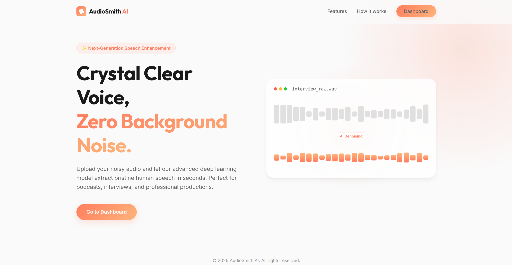
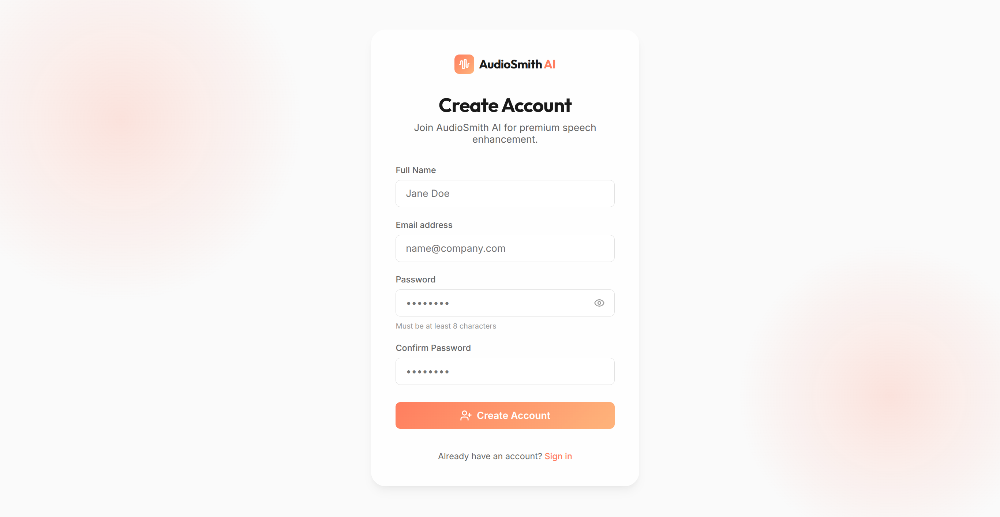
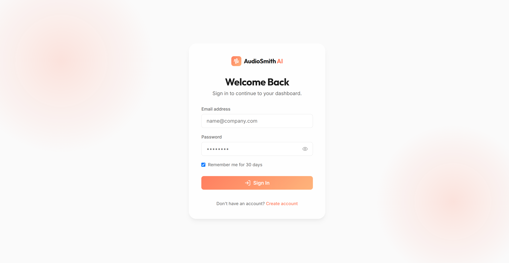
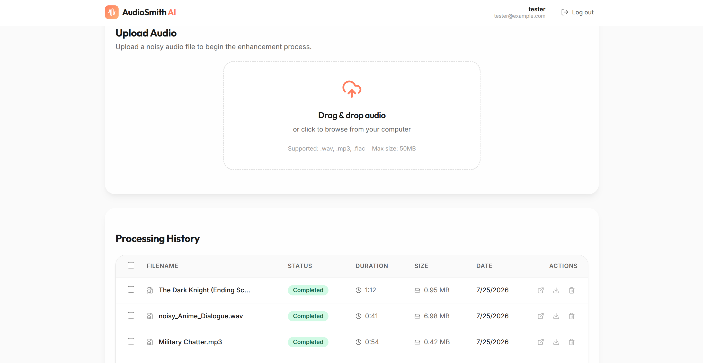
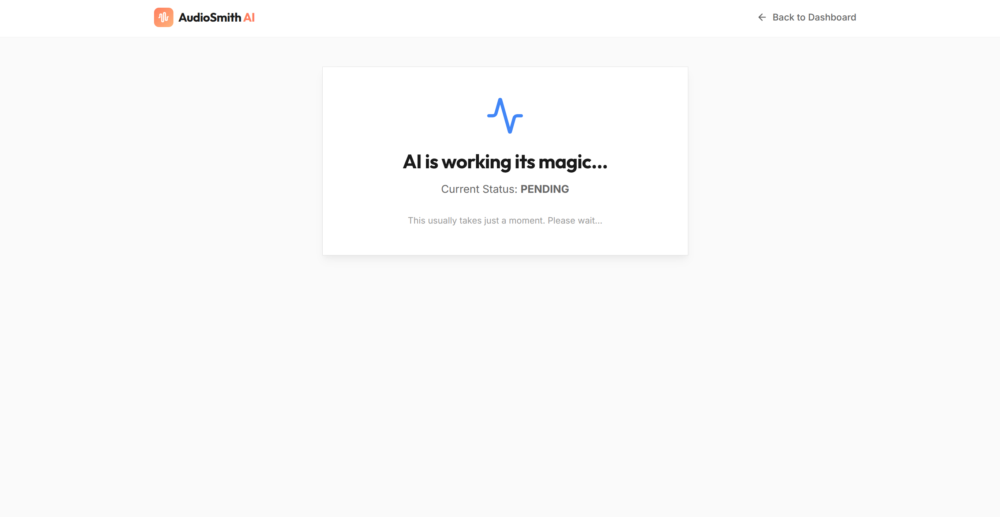
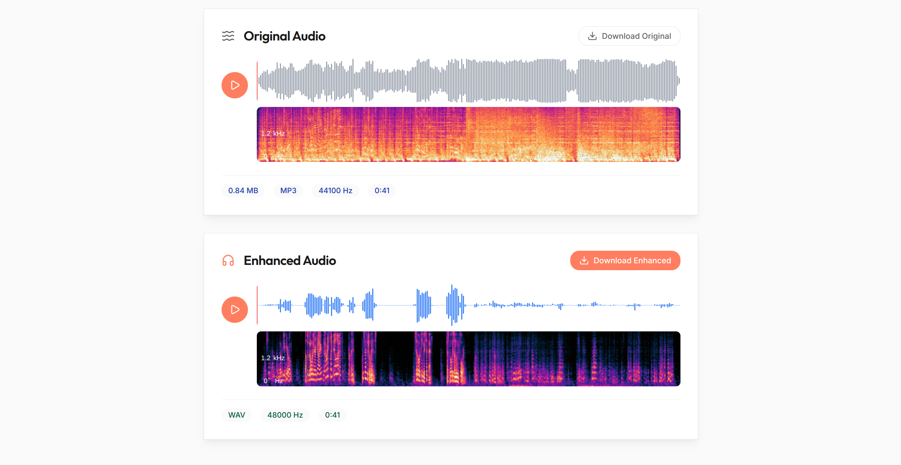

<div align="center">

# AudioSmith AI

**Production-Grade Artificial Intelligence for Professional Audio Enhancement**

AudioSmith AI is a full-stack platform engineered to deliver pristine speech denoising through state-of-the-art deep learning. Designed specifically for audio engineers, podcasters, and content creators, the application seamlessly removes complex background noise and reverberation while preserving the natural fidelity of human speech. 

<br />

<!-- Badges -->


<br />

[Features](#features) •
[Architecture](#architecture) •
[Tech Stack](#tech-stack) •
[Getting Started](#getting-started) •
[Screenshots](#application-walkthrough)

</div>

---

# Application Walkthrough

## Landing Page
<div align="center">
  
</div>
<br />
AudioSmith AI welcomes users with a premium, modern landing page showcasing glassmorphism aesthetics and clear value propositions.

---

## Create Account
<div align="center">
  
</div>
<br />
A frictionless registration experience securely hashes credentials before persisting them to the database.

---

## Login
<div align="center">
  
</div>
<br />
Fast, JWT-based authentication ensuring secure access to personal audio workspaces.

---

## Dashboard
<div align="center">
  
</div>
<br />
The core workspace features an intuitive drag-and-drop upload zone, complete processing history, and streamlined navigation for optimal user experience.

---

## Processing
<div align="center">
  
</div>
<br />
Real-time progress feedback during asynchronous background processing, detailing the AI enhancement workflow stages.

---

## Results
<div align="center">
  
</div>
<br />
Interactive side-by-side evaluation of original and enhanced audio. Includes waveform and spectrogram comparisons, synchronized replay capabilities, and direct download links.

---

# Features

### Authentication
* **JWT**: Stateless, highly secure token-based access.
* **Secure login**: Encrypted password verification.
* **Registration**: Seamless user onboarding with robust input validation.

### Audio Processing
* **WAV**: Uncompressed, lossless processing.
* **MP3**: Broadly compatible compressed formats.
* **FLAC**: High-fidelity lossless audio handling.

### AI Pipeline
* **Preprocessing**: Automated resampling and format conversion.
* **Enhancement**: Neural network inference for noise removal.
* **Postprocessing**: Normalization and anti-clipping measures.

### Visualization
* **Waveform comparison**: Granular visual feedback of amplitude changes.
* **Spectrogram comparison**: Frequency domain representation of noise reduction.

### History
* **Processing history**: Persistent record of all previous jobs.
* **Replay**: In-browser synchronized playback.
* **Delete**: Complete file and record removal.
* **Bulk delete**: Efficient management of large workspaces.

### UI
* **Responsive**: Flawless experience across mobile, tablet, and desktop devices.
* **Animations**: Fluid micro-interactions powered by Framer Motion.
* **Premium design**: Glassmorphism, subtle shadows, and modern typography.

### Backend
* **FastAPI**: Ultra-fast asynchronous HTTP routing.
* **Celery**: Reliable background job execution.
* **Redis**: In-memory message broker for task dispatching.
* **Asynchronous jobs**: Non-blocking inference processing.

### Database
* **PostgreSQL**: Robust relational data persistence.

### Docker
* **Production-ready containers**: Isolated, scalable, and reproducible environments.

### Configuration
* **Environment variables**: Strict separation of configuration from code.
* **Modular architecture**: Clean separation of API, logic, and data layers.

---

# AI / ML Engineering

AudioSmith AI is fundamentally driven by advanced machine learning engineering, prioritizing low-latency inference and high-fidelity output. 

### DeepFilterNet
We leverage **DeepFilterNet**, a highly efficient and state-of-the-art deep learning model designed explicitly for real-time speech enhancement. It was chosen for its exceptional balance between computational efficiency and perceptual quality, capable of removing complex, non-stationary background noise while maintaining the structural integrity of the human voice.

### Current Inference Pipeline
The inference pipeline is heavily optimized for asynchronous execution. Models are loaded precisely once per worker lifecycle, utilizing in-memory caching to prevent disk I/O bottlenecks. Audio tensors are resampled and routed directly through the inference graph, ensuring the web layer remains highly responsive even during intensive processing loads.

### Model Abstraction
The system utilizes a clean model abstraction layer. The underlying deep learning logic is heavily decoupled from the application routing, meaning the model architecture can be swapped, upgraded, or benchmarked without altering the API or frontend layers.

### Evaluation Metrics Implemented
The repository includes comprehensive evaluation infrastructure designed to quantify speech enhancement quality. Supported metrics include:
* **PESQ** (Perceptual Evaluation of Speech Quality)
* **STOI** (Short-Time Objective Intelligibility)
* **SI-SDR** (Scale-Invariant Signal-to-Distortion Ratio)
* **SNR** (Signal-to-Noise Ratio)

### Dataset Support
The platform's machine learning scripts seamlessly integrate with industry-standard datasets for robust evaluation and experimentation:
* **LibriSpeech** (Clean speech baseline)
* **MUSAN** (Music, Speech, and Noise corpus)
* **VoiceBank-DEMAND** (Noisy speech evaluation benchmark)

*Note: The repository also contains a complete fine-tuning infrastructure for future model customization and experimentation.*

---

# Tech Stack

| Domain | Technology |
| :--- | :--- |
| **Frontend** | Next.js, React, Vanilla CSS, WaveSurfer.js, Framer Motion |
| **Backend** | FastAPI, Python 3.11+ |
| **Machine Learning** | PyTorch, Torchaudio, DeepFilterNet |
| **Database** | PostgreSQL, SQLAlchemy |
| **Task Queue** | Celery, Redis |
| **Visualization** | WaveSurfer.js |
| **Containerization**| Docker, Docker Compose |
| **Build Tools** | Make, Uvicorn |
| **Languages** | TypeScript, Python |

---

# Architecture

AudioSmith AI follows a strictly decoupled architecture, ensuring that heavy machine learning workloads never block the HTTP layer.

<div align="center">

```text
┌─────────────────┐       ┌─────────────────┐       ┌─────────────────┐
│    Frontend     │       │    REST API     │       │ Authentication  │
│  (Next.js UI)   │ ────▶ │ (FastAPI Route) │ ────▶ │  (JWT & Hash)   │
└─────────────────┘       └─────────────────┘       └────────┬────────┘
                                                             │
                                                             ▼
                                                    ┌─────────────────┐
                                                    │   Task Queue    │
                                                    │ (Celery/Redis)  │
                                                    └────────┬────────┘
                                                             │
                                                             ▼
┌─────────────────┐       ┌─────────────────┐       ┌─────────────────┐
│    Database     │       │     Storage     │       │  DeepFilterNet  │
│  (PostgreSQL)   │ ◀──── │ (File Volumes)  │ ◀──── │ (ML Inference)  │
└─────────────────┘       └─────────────────┘       └─────────────────┘
```

</div>

* **Frontend**: The Next.js client handles all visual rendering, state management, and asset uploads.
* **REST API**: FastAPI acts as the high-performance gateway, validating requests and managing the data model.
* **Authentication**: All endpoints are secured via JWT. Passwords are mathematically hashed before reaching the database.
* **Task Queue**: Heavy audio processing is offloaded to Redis and Celery, keeping the web API entirely non-blocking.
* **DeepFilterNet**: A dedicated worker consumes the task, loads the audio into memory, and passes it through the PyTorch neural network.
* **Storage**: Processed binary audio files are safely written to isolated local volumes.
* **Database**: PostgreSQL tracks job states, file paths, and user metadata.

---

# Project Structure

```text
AudioSmith/
├── backend/            # FastAPI application, SQLAlchemy models, Celery workers
├── checkpoints/        # Stored ML model weights (.pt files)
├── datasets/           # Downloaded training and validation corpora
├── docker/             # Dockerfiles for API, Worker, and Frontend
├── docs/               # Architecture diagrams and README images
├── frontend/           # Next.js web application, React components, CSS
├── ml/                 # Model evaluation and fine-tuning scripts
├── notebooks/          # Jupyter notebooks for model exploration and fine-tuning
├── scripts/            # Utility scripts for asset downloading and environment setup
├── storage/            # User-uploaded audio and processed results
├── tests/              # Test suites and test audio fixtures
├── scratch/            # Local scratch scripts and experimentation tools
├── docker-compose.yml  # Multi-container orchestration
├── Makefile            # Convenience commands for development
└── README.md           # Project documentation
```

* **`backend/`**: Contains the core REST API routing, database schema, and background task definitions.
* **`checkpoints/`**: Safely holds downloaded deep learning model weights outside of version control.
* **`datasets/`**: Manages the storage of large audio datasets used for evaluation and ML tooling.
* **`docker/`**: Houses isolated, production-ready Dockerfiles for every microservice.
* **`docs/`**: Stores visual assets and documentation graphics.
* **`frontend/`**: The complete Next.js React application, including custom hooks and UI components.
* **`ml/`**: Advanced machine learning engineering scripts for computing metrics (PESQ, STOI) and handling PyTorch datasets.
* **`scripts/`**: Automation scripts to quickly initialize the local environment and fetch required assets.
* **`storage/`**: The local volume mount where raw and enhanced audio files are securely saved.

---

# Getting Started

Follow these steps to launch the entire AudioSmith AI stack locally.

### Prerequisites
* Docker & Docker Compose
* Git

### Clone
```bash
git clone https://github.com/yourusername/AudioSmith.git
cd AudioSmith
```

### Environment Variables
```bash
cp .env.example .env
```
*(Ensure you review `.env` to configure your specific database credentials if necessary. The defaults work seamlessly with Docker).*

### Docker
The entire application is strictly containerized. To build and start the services:

```bash
docker compose up --build -d
```

### Run Locally
Once the containers are successfully running, access the application:
* **Web UI**: [http://localhost:3000](http://localhost:3000)
* **API Docs**: [http://localhost:8000/api/docs](http://localhost:8000/api/docs)

### Useful Commands
Verify running services:
```bash
docker compose ps
```
View backend logs:
```bash
docker compose logs -f api
```
View Celery worker logs (monitor inference):
```bash
docker compose logs -f worker
```
Safely tear down the environment:
```bash
docker compose down -v
```

---

# AI Processing Pipeline

<div align="center">

```text
[ Upload ]
    ↓
[ Validation ]
    ↓
[ Preprocessing ]
    ↓
[ Background Task ]
    ↓
[ DeepFilterNet Inference ]
    ↓
[ Postprocessing ]
    ↓
[ Storage ]
    ↓
[ Results ]
```

</div>

* **Upload**: The client transmits binary audio data securely to the FastAPI endpoint.
* **Validation**: The backend verifies file signatures, limits file size, and ensures the format is supported.
* **Preprocessing**: Audio is loaded into PyTorch via `torchaudio`, converted to `float32` tensors, and resampled to the required 48kHz frequency.
* **Background Task**: The tensor reference is dispatched to the Celery queue.
* **DeepFilterNet Inference**: The PyTorch model removes background noise, executing entirely in memory.
* **Postprocessing**: The resulting enhanced tensor is normalized to prevent audio clipping and artifacts.
* **Storage**: The finalized audio is encoded back to a standard format and persisted to the storage volume.
* **Results**: The frontend aggressively polls the job status, eventually rendering the enhanced audio visualizations to the user.

---

# Design Principles

* **Clean Architecture**: System boundaries are strictly enforced. The Next.js frontend has absolutely no knowledge of the PyTorch implementation, interacting only via standardized REST contracts.
* **Separation of Concerns**: Each microservice handles one specific domain. The API routes traffic, the Worker infers, and the UI renders.
* **Modular Design**: Machine learning models and evaluation scripts are isolated in the `ml/` folder, preventing the backend from becoming bloated with training dependencies.
* **Dependency Injection**: FastAPI endpoints heavily utilize injected database sessions and authentication dependencies to ensure highly testable code.
* **Repository Pattern**: Database interactions are abstracted behind repository functions, meaning the core logic is entirely unaware of the underlying SQLAlchemy implementation.
* **Configuration-driven development**: All environment variables, ports, and model paths are dynamically injected via `.env`, preventing hardcoded configuration.
* **SOLID principles**: Classes and functions are designed to have single responsibilities, making the codebase highly predictable and easy to extend.

---

# Future Roadmap

* Training from scratch
* Model benchmarking
* Additional denoising architectures
* ONNX acceleration
