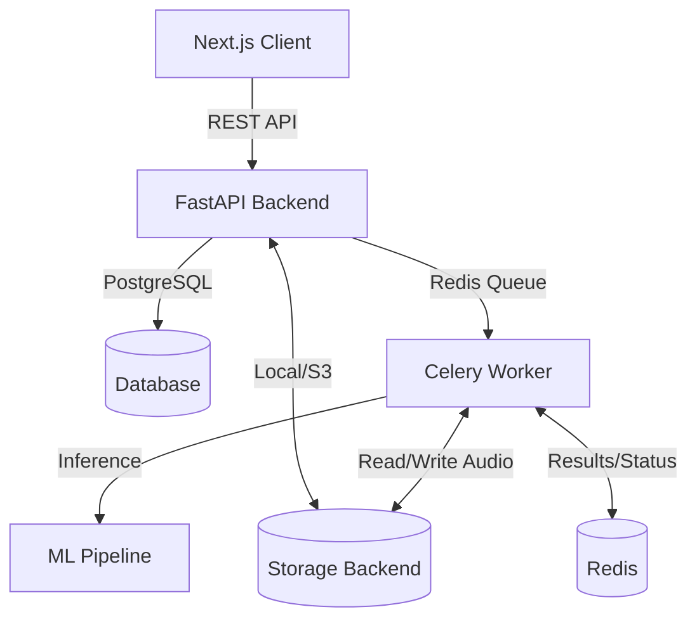

# AudioSmith AI — Architecture Overview

AudioSmith AI is a production-grade AI SaaS application designed to remove background noise from human speech recordings. It is engineered with a focus on maintainability, scalability, and an excellent user experience.

## High-Level Architecture

The system is composed of several decoupled services, coordinated via Docker Compose for local development.

## Frontend (Next.js 15)

The frontend uses Next.js 15 with the App Router. It is structured using a **feature-driven** architecture rather than grouping by file type.

- `src/app/` is strictly for routing and layouts.
- `src/features/` contains the domain logic (auth, processing, history).
- **Styling**: Vanilla CSS with custom properties (design tokens) for maximum control. Tailwind is avoided.

## Backend (FastAPI)

The backend follows **Clean Architecture** principles to ensure business logic remains isolated from the web framework and database constraints.

1. **Routers** (`app/api/`): HTTP endpoints and request validation (Pydantic).
2. **Services** (`app/services/`): Core business logic.
3. **Repositories** (`app/repositories/`): Data access layer (SQLAlchemy).

## ML Pipeline

The ML pipeline is designed around the `BaseSpeechEnhancer` abstract base class. This enables swapping models without altering the surrounding business logic.

- **Primary Model**: DeepFilterNet (48kHz, CPU-optimized for real-time inference).
- **Evaluation Model**: Conv-TasNet (benchmarking only).
- **Processing**: The pipeline handles resampling, normalization, inference, and postprocessing, run via background Celery tasks to prevent blocking the API event loop.

## Infrastructure

- **PostgreSQL**: Primary data store for users, files, and job metadata.
- **Redis**: Message broker for Celery tasks and result backend.
- **Storage**: Abstraction (`StorageBackend`) supports local filesystem for development and can be swapped for S3 in production.
